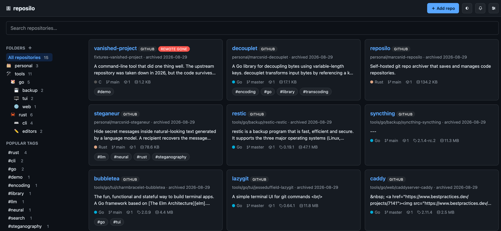
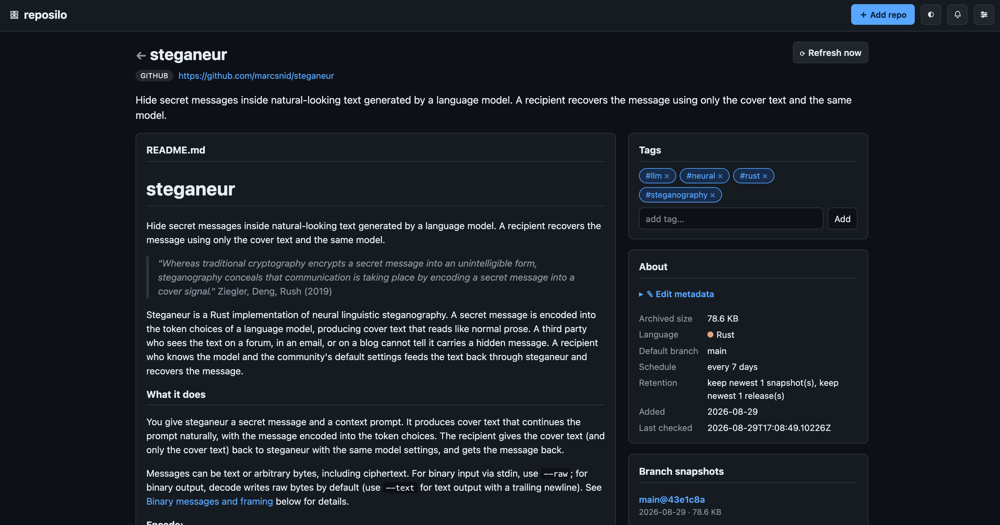

# reposilo

Self-hosted git repo archiver that saves and manages code repositories.

Each repo is kept as shallow snapshots and release tags (plain zips on
disk), so the archive is still browsable and searchable if the remote ever
goes away.

[](screenshots/reposilo-main.png)

## What it does

- **Archive** any git repo as a shallow snapshot (zip or tar.zst) + release
  tags, on a configurable schedule, with configurable retention
- **Survive** dead remotes: if a repo goes down, your copy stays browsable
  forever; after 3 weeks unreachable it's marked dead and the scheduler stops
  calling out to it
- **Import** directories of zipped repos: offline detection (`.git/config`,
  package manifests, READMEs), GitHub search + llama.cpp identification for
  the hard ones, park unidentifiable ones for later
- **Organize** with tags, folders, and search; languages are detected from
  file contents; GitHub topics auto-import as suggested tags; llama.cpp
  auto-tags from README content
- **Browse** rendered READMEs, file listings, individual file viewing,
  all read from the zip on demand (no unzip needed)
- **Notify** on new releases with readable changelogs (GitHub release notes
  or `CHANGELOG.md` at the tag); optional webhook for external alerts
- **Verify** the archive on demand: hash every stored zip against the sha256
  in its sidecar, from `reposilo verify` or a Settings button, to catch missing
  or corrupt files
- **Collect release binaries**: download the platform-specific assets attached
  to a release, filtered to the OS/arch you care about. Names like
  `foo-win64.zip`, `foo-x86_64-unknown-linux-gnu.tar.gz` and `Bar-1.0-arm64.dmg`
  all resolve correctly.

[](screenshots/reposilo-repo.png)

## Storage model (datahoarder-first)

```
<archive_root>/<owner>-<repo>/             # flat: forks can't collide
├── repo.json        # manifest: origin, tags, schedule, retention
├── README.md        # plain README of the default branch (few KB)
├── branch/<branch>/ # snapshots: repo-branch@date_sha.zip + .json sidecar
└── releases/<tag>/  # releases: repo-tag.zip + .json sidecar
    └── assets/       # release binaries for the platforms you enabled
```

- **The zip is the only persistent artifact**: git clones are ephemeral
  (temp clone → zip → delete), so disk = zips + tiny JSON/README files
- Every generated zip carries `.reposilo.json` **inside it** (AIO:
  copy a single zip anywhere and it's still self-describing)
- Zip filenames start with the project name (`ripgrep-master@2025-01-15_a1b2c3d.zip`)
- Disk is the source of truth; the index is fully rebuildable from it
- Archive format configurable: `zip` (default, universally unzip-able) or
  `tar.zst` (better compression for large repos)
- Imported zips keep their original filenames and are exempt from retention
  pruning (irreplaceable)
- Content-addressed dedup: when a release tag points at the same commit as
  the branch HEAD, the two archives share one file on disk (hard link). The
  shared file keeps the original snapshot's embedded `.reposilo.json`; each
  snapshot's external sidecar records its own kind/ref/version

## Install

Grab a prebuilt binary from the
[releases page](https://github.com/marcsnid/reposilo/releases) (linux, macOS and
windows; x64 and arm64), or build from source:

```sh
cargo build --release
```

The only runtime dependency is `git`.

## Usage

```sh
# setup
reposilo init --root /path/to/archive
reposilo user add yourname --password <pw>   # optional: enable login

# add + manage repos
reposilo add https://github.com/n64decomp/sm64.git --tag decomps --tag n64
reposilo list --tag decomps --tag n64
reposilo refresh all                         # pull new snapshots/releases
reposilo reindex --catalog                    # stats + catalog.json
reposilo verify                               # hash every zip against its sidecar

# import a zip collection
reposilo import /path/to/zips --dry-run       # preview (touches nothing)
reposilo import /path/to/zips --copy --tag imported

# migrate an old archive to the current layout
reposilo migrate-folders                     # owner/repo → owner-repo folders
reposilo prune-shallow                       # remove old git stores (zip-only)

# start the web UI + API + scheduler
reposilo serve                               # 127.0.0.1:8765 by default
reposilo serve --bind 0.0.0.0:8765           # or REPOSILO_BIND=0.0.0.0:8765
# GET /healthz is an unauthenticated liveness probe (200 while the server is up)
# open http://127.0.0.1:8765:
#   - search, tag-filter, browse repos with rendered READMEs
#   - create and manage folders (any nesting depth, emoji icons or colored dots);
#     drag cards onto a folder to move repos between them
#   - edit metadata (name, description, notes, origin, folder, tags) per repo
#   - import zips from Settings; assign origins to _unknown repos
#   - notifications with readable release changelogs
#   - verify the whole archive from Settings (hashes every zip)
#   - dark/light theme, settings (retention, scheduler, llama.cpp)
#   - a REST API; downloads stream straight from disk
```

```sh
# AI auto-tagging (needs llama.cpp configured in Settings)
reposilo autotag --dry-run                   # preview suggested tags
reposilo autotag                             # apply (merges, never removes)
```

### Configuration

The config file lives at `~/.config/reposilo/config.toml` (or `--config`):

```toml
[archive]
root = "/path/to/archive"
format = "zip"             # or "tar.zst" (zstd level 10 by default)

[retention]
keep_branch_snapshots = 1   # -1 keeps everything
keep_releases = 1          # -1 keeps everything
# [[retention.tag_rules]]  # per-tag overrides:
# tag = "decomps"
# keep_releases = -1

[scheduler]
default_interval_days = 7
release_poll_hours = 24
dead_after_days = 21       # stop checking after N days unreachable
# The scheduler checks a repo when `min(default_interval_days * 24,
# release_poll_hours)` has elapsed since its last check. For a plain weekly
# cadence (weekly main + weekly release check) set release_poll_hours = 168.

[git]
# depth = 1                # 1 = shallow snapshot, 0 = full mirror
# timeout_secs = 600       # hard kill for hung git subprocesses (network hangs)

[github]
# token = "env:GITHUB_TOKEN"  # better rate limits for enrichment

[gitlab]
# token = "env:GITLAB_TOKEN"   # private GitLab release assets

[forgejo]
# token = "env:FORGEJO_TOKEN"  # private Forgejo/Codeberg release assets

[releases]
# Also download the binary assets attached to releases, for these platforms.
# Filters match the asset filename loosely: an OS ("linux"), an arch
# ("arm64"), a full slug ("darwin-arm64") or "all". "win64" == "windows-x64".
# Empty = no binaries are downloaded (the safe default). Downloads are
# size-capped and verified against the forge's sha256 when one is published.
platforms = ["darwin-arm64", "linux-x64"]
# max_asset_mb = 0            # 0 = no per-file size limit
[llm]
enabled = false
url = "http://192.168.0.1:11434/v1"  # any OpenAI-compatible endpoint
# model = "Qwen3.6-27B-GGUF"

[notifications]
# webhook_url = "https://hooks.example.com/your-hook"  # new releases + dead links

[otel]
# enabled = true
# endpoint = "http://localhost:4318"  # OTLP/HTTP collector base URL; /v1/metrics is appended
# service_name = "reposilo"
# interval_secs = 60
```

### Stats and monitoring

Every instance has a built-in **Stats** page (`/stats`, also in the top bar)
and a JSON API at `/api/stats`. It shows current totals (repos, snapshots,
releases, dead/unavailable remotes, untagged) plus a per-day 7-day bar chart
of refresh successes vs failures and a table of recent days. Counters are
persisted to `<archive>/metrics.json` for 90 days, so they survive restarts.

Setting `[otel] enabled = true` additionally pushes the same numbers to an
OpenTelemetry collector over OTLP/HTTP (JSON). It is optional and best-effort:
a failing collector only logs a warning and never affects archiving.

### Users and auth

Auth is opt-in. Without `users.json` in the archive root, everything is open
(backwards compatible). Add users to require login:

```sh
reposilo user add alice --password <pw>   # or REPOSILO_PASSWORD env var
reposilo user list
reposilo user remove alice
```

Sessions are 7-day cookies; logout clears them. The CLI can manage users
while the server is running (hot-reload).

Auth **fails closed**: if `users.json` exists but is unreadable or corrupt,
the server stays locked (logins are rejected) instead of silently opening up.
Fix the file to restore access. Deleting it entirely disables auth again.

## Docker

A two-stage `Dockerfile` builds a static musl binary and drops it into a
minimal Alpine runtime. The runtime is Alpine rather than `scratch` because
the archiver shells out to `git`, which is not statically linked.

```sh
docker build -t reposilo .
```

Or use the example stack:

```sh
cp docker/config.example.toml docker/config.toml   # edit archive, platforms, tokens
docker compose up -d
```

The app speaks plain HTTP on port 8765; run a reverse proxy in front and keep
the published port on `127.0.0.1`. Prebuilt images live on GHCR at
`ghcr.io/marcsnid/reposilo`: `latest` plus a `YYYYMMDD` snapshot on every
`main` push, and the version tags on `v*` tags. The compose file runs the
container read-only with all capabilities dropped and only `/config`,
`/archive` and `/tmp` writable.

If you clone over SSH instead of HTTPS, add `openssh-client` to the runtime
stage and mount your keys. The container sets `REPOSILO_BIND=0.0.0.0:8765`
(override with `-e REPOSILO_BIND=...`).

## Roadmap

- **git bundle archives**: a full-history bundle saved alongside the
  snapshot, so a dead repo can be re-established (re-cloned, re-pushed),
  not just browsed
- **Content-addressed dedup across repos**: currently dedup is per-repo
  (a release zip and branch snapshot pointing at the same commit share one
  file on disk), but identical content in *different* repos is stored twice
- **Forge enrichment beyond GitHub**: stars, topics, and release notes for
  GitLab and Forgejo
- **Archive export/sync**: a guided way to move an archive tree between
  machines (verify integrity, rebuild the index on the far end)

## Development

```sh
cargo build --release
cargo test
cargo clippy
```

Single binary (templates + CSS + htmx compiled in). No external services
required except git and optionally a llama.cpp endpoint for AI tagging.

## License

MIT. See [LICENSE](LICENSE).
